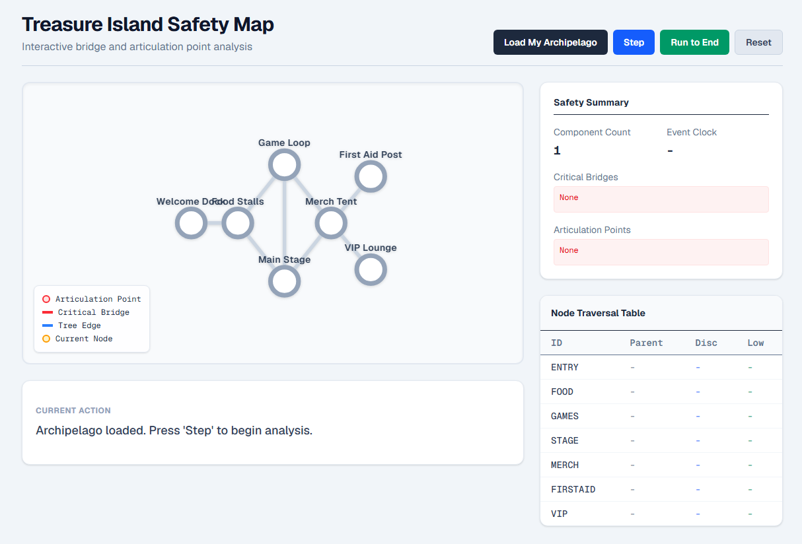
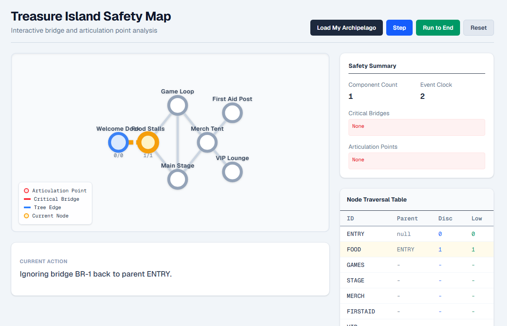
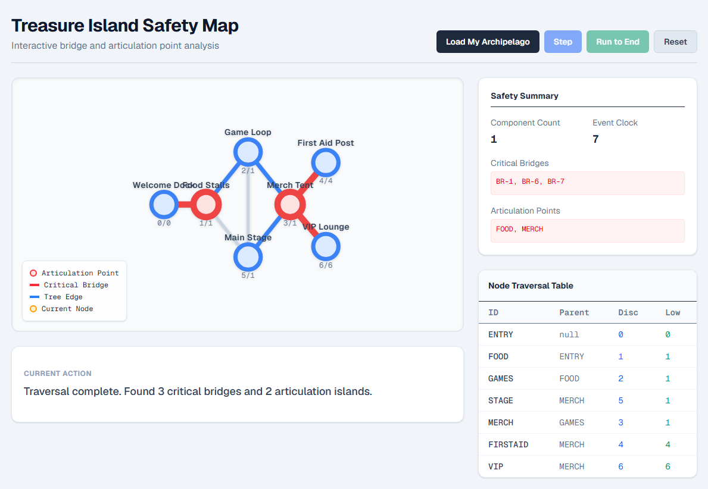

# Treasure Island Safety Map
<table>
  <tr>
    <td></td>
    <td></td>
    <td></td>
  </tr>
</table>

**Author:** ADITYA SING | **ID:** 23U03031

An interactive, web-based visualizer for identifying critical bridges and articulation points within a network, utilizing an event-driven implementation of Tarjan's low-link DFS algorithm.

---

## 1. Implementation Plan

*   **Graph Validation and Adjacency Construction:** We will define a strict TypeScript schema for the nodes (6–9 islands) and undirected edges (6–13 bridges). The initial calculation engine will validate finite x and y coordinates, ensure unique IDs, reject self-loops, and build deterministic adjacency lists sorted in ascending ASCII order.
*   **Low-Link DFS Traversal and Event Logging:** We will implement Tarjan's algorithm using a zero-based discovery clock to identify critical bridges and articulation points. Instead of just returning the final arrays, this DFS function will push structured event objects (e.g., node discovered, edge inspected, low value updated) to an array, capturing every numerical change for the visualizer.
*   **Replay Engine and State Management:** We will build a custom React hook to manage the event array, exposing the required Load My Archipelago, Step, Run to End, and Reset controls. This controller will keep the active event, the map highlights, and the numeric node table perfectly synchronized during playback.
*   **Visualization and Node Table UI:** We will construct a frontend workspace featuring an SVG-based island map that distinguishes unvisited, current, and classified states. Alongside the map, we will render a compact node table displaying IDs, parents, discovery/low values, component counts, and sorted critical-item summaries.

---

## 2. System Architecture: The "Festival" Mental Model

To understand the codebase, think of our code as a team organizing a festival:
*   **`types.ts` (The Rulebook):** This file just defines our vocabulary. It says, "An Island must have an ID and coordinates," and "A Bridge connects exactly two islands.". It also lists every possible event our explorer can report, like discovering an island or finding a critical bridge.
*   **`data.ts` (The Paper Map):** This is our actual festival layout. It lists our 7 specific islands (like "Food Stalls" and "Main Stage") and the 8 bridges connecting them.
*   **`graph.ts` (The Safety Inspector):** Before anyone walks the islands, this inspector checks the paper map for mistakes. It makes sure no bridge connects an island to itself and that no islands share the same name. Then, it creates a neat, alphabetical list for every island showing exactly which other islands it connects to.
*   **`tarjan.ts` (The Explorer with a Camera):** This is the heavy algorithm. Imagine a person walking the bridges with a stopwatch and a camera. They step on an island and write down the exact time. If they walk down a path, hit a dead end, and realize they can't circle back to the start, they flag that path as a dangerous bridge. Every single time they take a step or make a decision, they snap a photo of their notebook. By the end, they hand us a massive stack of photos detailing the entire journey.
*   **`useReplay.ts` (The TV Remote):** This file takes that stack of photos from the Explorer and puts them on a screen. It gives the user the exact controls required: Step (show the next photo), Run to End (fast forward to the final photo), and Reset (rewind to the beginning).

---

## 3. Key Engineering Decisions

### 1. Snapshot-Based Event Logging for DFS
*   **Why we chose it:** The contract requires a step-by-step visual replay engine. Pushing a full clone of the discovery and low-link state to an array at every traversal step turns time-travel into a simple array index (`currentIndex`).
*   **Alternative:** Using JavaScript Generator functions (`yield`) to pause execution, or async/await with delays.
*   **Trade-off:** Snapshotting consumes more memory (storing deep copies of the state for $O(V+E)$ events) compared to a generator. However, it completely eliminates asynchronous race conditions in React and makes the `Reset` and `Run to End` features instant.

### 2. SVG `viewBox` for Map Rendering
*   **Why we chose it:** The problem restricts node coordinates to a finite `0` to `100` range. Setting the SVG `viewBox` to `-10 -10 120 120` automatically scales the map proportionally to any screen size without manual pixel math.
*   **Alternative:** Using HTML5 Canvas or a heavy graph visualization library like D3.js or Cytoscape.
*   **Trade-off:** SVG DOM nodes can become a performance bottleneck if rendering thousands of elements. Since the contract caps the engine at 12 nodes and 20 edges, SVG is vastly superior for its native CSS styling, simple React integration, and zero external dependencies.

### 3. Strict ASCII Pre-Sorting of Adjacency Lists
*   **Why we chose it:** The contract explicitly requires that the input array order must not alter the traversal or the result, and neighbors must be inspected in ascending node-ID order.
*   **Alternative:** Processing the graph exactly as provided in the raw input array.
*   **Trade-off:** Pre-sorting adds an $O(V \log V + E \log E)$ initialization cost before the $O(V + E)$ DFS begins. While marginally slower at startup, it guarantees determinism, allowing our reversed-array test cases to pass.

### 4. Strict Separation of Graph Logic and UI State
*   **Why we chose it:** To prepare for the 10-minute live modification requirement. By decoupling the Tarjan algorithm (`tarjan.ts`) from the React playback hook (`useReplay.ts`) and modularizing the visual components (`IslandMap`, `SafetySummary`), modifications are strictly isolated.
*   **Alternative:** Writing a monolithic `page.tsx` that interleaves graph calculation with React state (`useState` inside the DFS).
*   **Trade-off:** Requires more upfront architectural boilerplate and file switching. The massive benefit is a reduced blast radius; changing how a bridge is highlighted won't accidentally break the DFS clock.

### 5. Treating the Root Node as a Special Case for Articulation
*   **Why we chose it:** A fundamental rule of Tarjan's algorithm is that the DFS root is an articulation point if and only if it has at least two independent DFS-tree children. We tracked `childrenCount` specifically for the root, bypassing the standard `low[v] >= discovery[u]` check used for non-root nodes.
*   **Alternative:** Attempting to force the root node to evaluate using the standard low-link inequality logic.
*   **Trade-off:** Adding an explicit `if (u === rootId)` branch slightly increases code complexity. However, it perfectly aligns with the mathematical definition of DFS articulation points and satisfies the contract's strict rule for root child-counts.

---

## 4. Testing & Validation

We created Jest tests in `__tests__/tarjan.test.ts` covering four major areas[cite: 3]:

1.  **Input-order independence:** Verifies that shuffled node/edge input does not change traversal or results, and ensures adjacency lists are processed in deterministic ASCII order[cite: 3].
2.  **Cycle handling:** Verifies that a cycle-only graph produces no false bridges or articulation points, and validates correct low-link updates for back edges[cite: 3].
3.  **DFS root, disconnected graphs & isolated nodes:** Verifies traversal across multiple components, handles isolated nodes, and validates the special articulation-point rule for DFS roots[cite: 3].
4.  **Invalid graph input:** Verifies rejection of invalid coordinates, duplicate node IDs, and self-loops[cite: 3].

**Current Test Status:** All existing Jest tests pass successfully[cite: 3].

**Identified Test Gaps:** The implementation still needs focused tests for exact event ordering, the `low[v] > discovery[u]` vs `low[v] >= discovery[u]` boundary, unknown edge endpoints, and `useReplay.reset()` behavior[cite: 3].

---

## 5. AI Collaboration & Prompting Strategy

The development process utilized a human-in-the-loop, iterative prompting workflow[cite: 2].

### Prompt Categories Used
*   **Strategic & Assessment Prompts:** You started by pasting all four problem statements and explicitly asked for a comparison of difficulty and interview signal (e.g., "They also know that P3 and P4 are easy one, won't they ask tough questions? I am thinking of P1, but I need to be sure")[cite: 2]. You also prompted to validate technology stack choices ("should we make this project in c++? or typescript is good?")[cite: 2].
*   **Planning & Scaffolding Prompts:** Before generating any logic, you requested a strict roadmap ("tell me step by step: what to do me, u are mentor and i am manually add code there")[cite: 2].
*   **Sequential Code Generation Prompts:** Rather than asking for the entire application in one shot, you directed the generation file-by-file using precise triggers ("next - lib/graph.ts", "next tarjan .ts")[cite: 2].
*   **Conceptual Understanding Prompts:** To ensure you actually owned the generated logic, you paused the coding process to request an analogy-based explanation ("teach me these 5 files in easy language with examples , teaching to 5 yr old")[cite: 2].
*   **Requirement Verification Prompts:** You pasted the exact problem statement constraints and explicitly demanded a compliance check ("go thorught this scritly, have we made and cleared every point??")[cite: 2].
*   **Refactoring & Componentization Prompts:** After the initial UI was built, you recognized a structural weakness for the live-modification requirement and commanded a refactor ("we can break this page.tsx in more components smaller so that tommorror we will be easier to change")[cite: 2].
*   **Debugging Prompts:** When testing failed to initialize, you provided visual context (a screenshot of the terminal and VS Code errors) with a minimal text trigger ("err") to resolve the Jest configuration[cite: 2].
*   **Narrative & Interview Prep Prompts:** You generated material specifically for the interview conversation, such as asking for the "Why did you choose this problem?" narrative and requesting the 5 most important engineering decisions[cite: 2].

### Workflow Efficacy
*   **Strategic Alignment:** Prevented you from walking into a trap[cite: 2]. It clarified that while P1 carries higher algorithmic expectations, it provides a stronger platform to demonstrate your competitive programming background than P3 or P4[cite: 2]. It also locked in TypeScript/React to ensure the frontend visualization wouldn't consume your 24-hour window[cite: 2].
*   **Architectural Discipline:** Planning prompts established a 5-phase execution plan[cite: 2]. This kept the architecture organized (Types -> Data -> Logic -> State -> UI) and prevented overlapping errors[cite: 2].
*   **Code Quality & Componentization:** Sequential generation kept the context window focused, allowing the AI to concentrate entirely on strict input validation before shifting focus to the Tarjan DFS algorithm[cite: 2]. Later refactoring prompts decoupled the monolithic `page.tsx` into `Controls.tsx`, `EventExplainer.tsx`, and `NodeTable.tsx`, which directly mitigated the live-modification risk by isolating the UI components[cite: 2].
*   **Verification:** Requirement prompts served as an audit, confirming that edge cases like zero-based clocks, strict tie-breaking, and self-loop rejections were actually in the code before writing the tests[cite: 2].

### The Iterative Refinement Process
You did not use a "zero-shot" prompt (e.g., "Build the Treasure Island problem in Next.js")[cite: 2]. Instead, you drove a highly iterative, human-in-the-loop workflow[cite: 2]. You started by negotiating the problem choice, validating that P1 was worth the risk[cite: 2]. Once committed, you enforced a strict boundary by asking for a step-by-step plan before accepting any code[cite: 2]. During the build, you paced the generation by requesting one file at a time, forcing the AI to align with your manual file creation in VS Code[cite: 2]. 

The most critical iterative refinements happened when you actively intervened in the output[cite: 2]. After the backend was completed, you stopped the coding process entirely to ensure you understood the DFS snapshot mechanism[cite: 2]. Later, when the AI provided a monolithic `page.tsx` that technically satisfied the UI requirement, you rejected leaving it as-is, instructing the AI to componentize it specifically to prepare for the live-modification interview stage[cite: 2]. Finally, you used the completed codebase as context to generate your defense strategy (the 5 engineering decisions), turning the raw code into interview-ready talking points[cite: 2].